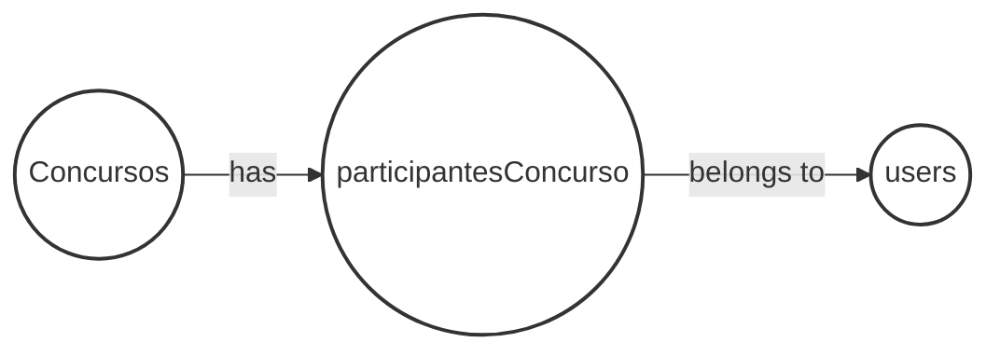

# Proyecto Final - DAM - Documentación

## 1. Tecnologías Utilizadas

*   **React Native:** Un framework de JavaScript para escribir aplicaciones móviles nativas para iOS y Android.
    *   Versión: 0.76.9
    *   Justificación: Desarrollo móvil multiplataforma, reutilización de código, gran soporte de la comunidad.
*   **Firebase:** Una plataforma Backend-as-a-Service (BaaS).
    *   Versión: 11.3.1
    *   Justificación: Autenticación, base de datos, almacenamiento y hosting.
*   **React Navigation:** Una librería para manejar la navegación en aplicaciones React Native.
    *   Versión: 4.4.4
    *   Justificación: Proporciona una manera sencilla de definir la estructura de la navegación de la aplicación.
*   **Expo:** Un framework y plataforma para aplicaciones React universales.
    *   Versión: ~52.0.37
    *   Justificación: Simplifica el desarrollo, la construcción y el despliegue de aplicaciones React Native.
*   **react-native-toast-message:** Una librería para mostrar mensajes toast.
    *   Versión: ^2.3.0

## 2. Diagramas

### Diagrama de la Base de Datos (Firebase - NoSQL)

### Diagrama de Arquitectura de la Aplicación

```mermaid
graph LR
    A[App.js] --> B(React Navigation);
    B --> C{Tab Navigator};
    C --> D(HomeStack);
    C --> E(Perfil);
    C --> F(PanelAdmin);
    D --> G[Home];
    D --> H[ListadoConcursos];
    D --> I[FichaConcurso];
    D --> J[Galeria];
    D --> K[RankingConcurso];
    D --> L[CrearConcurso];
    D --> M[ListaUsuarios];
    A --> N[Login];
    A --> O[Register];
    A --> P[ForgotPassword];
    style A fill:#232323,stroke:#fff,stroke-width:2px
    style B fill:#232323,stroke:#fff,stroke-width:2px
    style C fill:#232323,stroke:#fff,stroke-width:2px
    style D fill:#232323,stroke:#fff,stroke-width:2px
    style E fill:#232323,stroke:#fff,stroke-width:2px
    style F fill:#232323,stroke:#fff,stroke-width:2px
    style G fill:#232323,stroke:#fff,stroke-width:2px
    style H fill:#232323,stroke:#fff,stroke-width:2px
    style I fill:#232323,stroke:#fff,stroke-width:2px
    style J fill:#232323,stroke:#fff,stroke-width:2px
    style K fill:#232323,stroke:#fff,stroke-width:2px
    style L fill:#232323,stroke:#fff,stroke-width:2px
    style M fill:#232323,stroke:#fff,stroke-width:2px
    style N fill:#232323,stroke:#fff,stroke-width:2px
    style O fill:#232323,stroke:#fff,stroke-width:2px
    style P fill:#232323,stroke:#fff,stroke-width:2px
```

### Diagrama de Casos de Uso

```mermaid
graph LR
    A((Usuario)) --> B[Autenticarse];
    A --> C[Ver Concursos];
    A --> D[Participar en Concursos];
    A --> E[Ver Galería];
    A --> F[Ver Ranking];
    G((Administrador)) --> H[Gestionar Concursos];
    G --> I[Gestionar Usuarios];
    style A fill:#232323,stroke:#fff,stroke-width:2px
    style G fill:#232323,stroke:#fff,stroke-width:2px
    style B fill:#232323,stroke:#fff,stroke-width:2px
    style C fill:#232323,stroke:#fff,stroke-width:2px
    style D fill:#232323,stroke:#fff,stroke-width:2px
    style E fill:#232323,stroke:#fff,stroke-width:2px
    style F fill:#232323,stroke:#fff,stroke-width:2px
    style H fill:#232323,stroke:#fff,stroke-width:2px
    style I fill:#232323,stroke:#fff,stroke-width:2px
```

## 3. Desarrollo del Proyecto

*   **Decisiones Técnicas:**
    *   Uso de React Navigation para la navegación.
    *   Uso de Firebase para la autenticación y la gestión de datos.
*   **Dificultades Encontradas:**
    *   Configuración de Firebase.
    *   Implementación de la autenticación.
*   **Soluciones Implementadas:**
    *   Uso de la documentación de Firebase.
    *   Implementación de la autenticación con Firebase.

## 4. Manual de Instalación

1.  Instale Node.js y npm.
2.  Instale Expo CLI: `npm install -g expo-cli`
3.  Clone el repositorio.
4.  Navegue al directorio del proyecto: `cd Proyecto-Final-DAM`
5.  Instale las dependencias: `npm install`
6.  Configure Firebase:
    *   Cree un proyecto de Firebase.
    *   Habilite la autenticación.
    *   Cree una base de datos.
    *   Agregue la configuración de Firebase a `src/config/firebase.js`.
7.  Ejecute la aplicación: `expo start`

## 5. Manual de Usuario

1.  Descargue la aplicación de la tienda.
2.  Regístrese o inicie sesión.
3.  Explore los concursos.
4.  Participe en concursos.
5.  Vea la galería.
6.  Vea el ranking.

## 6. Manual de Administrador

1.  Inicie sesión como administrador.
2.  Gestione los concursos.
3.  Gestione los usuarios.

## 7. Consideraciones de Ampliación Futura

*   Implementación de notificaciones push.
*   Implementación de pagos.
*   Implementación de un sistema de comentarios.

## 8. Esquema de la base de datos

### Concursos:
*   createdAt
*   creatorId ""
*   descripcion ""
*   estado ""
*   fechaFin ""
*   fechaFinVotacion ""
*   fechaInicio ""
*   imagenConcursoUrl ""
*   nombreEvento ""
*   tema ""
*   usersId []

### participantesConcurso:
*   concursoId "potpTa9YufaGVKN1nXOW"
*   imagenes
    *   slot1
        *   delete_url ""
        *   estadoImagen ""
        *   uploadedAt
        *   url ""
    *   slot2
        *   delete_url ""
        *   estadoImagen ""
        *   uploadedAt
        *   url ""
    *   slot3
        *   delete_url ""
        *   estadoImagen ""
        *   uploadedAt
        *   url ""
*   userId ""

### users:
*   avatar ""
*   createdAt
*   email ""
*   name ""
*   role []
*   uid ""
