# Proyecto Final DAM

## Descripción General
Este proyecto es una aplicación móvil construida utilizando Expo y React Native. Incluye funcionalidades de autenticación de usuarios con opciones de inicio de sesión y registro.

## Estructura del Proyecto
```
Proyecto-Final-DAM
├── src
│   ├── App.js
│   ├── config
│   │   └── firebase.js
│   ├── pages
│   │   ├── CrearConcurso.js
│   │   ├── FichaConcurso.js
│   │   ├── ForgotPassword.js
│   │   ├── Galeria.js
│   │   ├── Home.js
│   │   ├── ListadoConcursos.js
│   │   ├── listaUsuarios.js
│   │   ├── Login.js
│   │   ├── PanelAdmin.js
│   │   ├── Perfil.js
│   │   ├── RankingConcurso.js
│   │   └── Register.js
│   ├── services
│   │   ├── authService.js
│   │   ├── contestService.js
│   │   ├── countdownService.js
│   │   ├── dateService.js
│   │   ├── imageService.js
│   │   ├── userService.js
│   │   └── validationService.js
├── index.js                # Punto de entrada de la aplicación
├── package.json            # Dependencias y scripts del proyecto
└── README.md               # Documentación del proyecto
```

## Descripción Detallada del Proyecto

### `src/App.js`
Este es el componente principal de la aplicación. Utiliza `react-navigation` para manejar la navegación entre diferentes pantallas. Define dos navegadores:
- `Stack Navigator`: Para la autenticación (Login, Register, ForgotPassword).
- `Tab Navigator`: Para la aplicación principal (Home, Perfil, PanelAdmin).

Utiliza `Firebase` para la autenticación y gestiona el estado del usuario (`currentUser`, `isAdminUser`).

### `src/config/firebase.js`
Este archivo contiene la configuración de Firebase para la aplicación. Inicializa Firebase y exporta la instancia de autenticación (`FIREBASE_AUTH`).

### `src/pages/`
Este directorio contiene los componentes de las diferentes páginas de la aplicación:
- `Login.js`: Componente para la página de inicio de sesión.
- `Register.js`: Componente para la página de registro.
- `Home.js`: Componente para la página principal.
- `PanelAdmin.js`: Componente para el panel de administración.
- `ForgotPassword.js`: Componente para la página de recuperación de contraseña.
- `Perfil.js`: Componente para la página de perfil del usuario.
- `ListadoConcursos.js`: Componente para listar los concursos.
- `FichaConcurso.js`: Componente para mostrar la ficha de un concurso.
- `CrearConcurso.js`: Componente para crear un nuevo concurso.
- `ListaUsuarios.js`: Componente para listar los usuarios.
- `Galeria.js`: Componente para la galería de imágenes.
- `RankingConcurso.js`: Componente para mostrar el ranking de un concurso.

### `src/services/`
Este directorio contiene los servicios utilizados por la aplicación:
- `authService.js`: Contiene funciones para la autenticación de usuarios (`logoutUser`, `isAdmin`).
- `contestService.js`: Contiene funciones para la gestión de concursos.
- `countdownService.js`: Contiene funciones para el manejo de cuenta regresiva.
- `dateService.js`: Contiene funciones para el manejo de fechas.
- `imageService.js`: Contiene funciones para la gestión de imágenes.
- `userService.js`: Contiene funciones para la gestión de usuarios.
- `validationService.js`: Contiene funciones para la validación de datos.

## Dependencias

- `@react-navigation/stack`: Se utiliza para la navegación entre pantallas en forma de pila (stack). Implementado en `src/App.js`.
- `@react-navigation/bottom-tabs`: Se utiliza para la navegación con pestañas en la parte inferior de la pantalla. Implementado en `src/App.js`.
- `@react-navigation/native`: Es el core de la librería de react-navigation. Implementado en `src/App.js`.
- `expo`: Framework para crear aplicaciones universales de React.
- `firebase`: Se utiliza para la autenticación y gestión de datos en la nube. Implementado en `src/config/firebase.js` y `src/services/authService.js`.
- `react`: Librería para construir interfaces de usuario.
- `react-native`: Framework para construir aplicaciones nativas con React.
- `react-native-vector-icons`: Se utiliza para mostrar iconos vectoriales. Implementado en `src/App.js`.

## Instalación
Para comenzar con el proyecto, clona el repositorio e instala las dependencias:

```bash
git clone <repository-url>
cd Proyecto-Final-DAM
npm install
```

## Ejecución de la Aplicación
Puedes iniciar la aplicación utilizando el siguiente comando:

```bash
npx expo start
```

Esto abrirá las herramientas de desarrollador de Expo en tu navegador. Luego, puedes ejecutar la aplicación en un simulador de Android o iOS, o en un dispositivo físico utilizando la aplicación Expo Go.

## Características
- Inicio de sesión y registro de usuarios
- Integración de Firebase para la autenticación
- Gestión de concursos
- Panel de administración
- Perfil de usuario
- Galería de imágenes
- Ranking de concursos

## Contribución
Siéntete libre de enviar problemas o pull requests para mejoras o correcciones de errores.

# Proyecto Final - DAM - Documentación

## 1. Tecnologías Utilizadas

*   **React Native:** A JavaScript framework for writing real, natively rendering mobile applications for iOS and Android.
    *   Version: 0.76.9
    *   Justification: Cross-platform mobile development, code reusability, large community support.
*   **Firebase:** A Backend-as-a-Service (BaaS) platform.
    *   Version: 11.3.1
    *   Justification: Authentication, database, storage, and hosting.
*   **React Navigation:** A library for handling navigation in React Native applications.
    *   Version: 4.4.4
    *   Justification: Provides a simple way to define the structure of the application's navigation.
*   **Expo:** A framework and platform for universal React applications.
    *   Version: ~52.0.37
    *   Justification: Simplifies the development, building, and deployment of React Native applications.
*   **react-native-toast-message:** A library for displaying toast messages.
    *   Version: ^2.3.0

## 2. Diagramas

### Diagrama de la Base de Datos (Firebase - NoSQL)

```mermaid
graph LR
    Concursos((Concursos))
    participantesConcurso((participantesConcurso))
    users((users))

    Concursos -- has --> participantesConcurso
    participantesConcurso -- belongs to --> users

    style Concursos fill:#232323,stroke:#fff,stroke-width:2px
    style participantesConcurso fill:#232323,stroke:#fff,stroke-width:2px
    style users fill:#232323,stroke:#fff,stroke-width:2px
```



### Diagrama de Arquitectura de la Aplicación

```mermaid
graph LR
    A[App.js] --> B(React Navigation);
    B --> C{Tab Navigator};
    C --> D(HomeStack);
    C --> E(Perfil);
    C --> F(PanelAdmin);
    D --> G[Home];
    D --> H[ListadoConcursos];
    D --> I[FichaConcurso];
    D --> J[Galeria];
    D --> K[RankingConcurso];
    D --> L[CrearConcurso];
    D --> M[ListaUsuarios];
    A --> N[Login];
    A --> O[Register];
    A --> P[ForgotPassword];
    style A fill:#232323,stroke:#fff,stroke-width:2px
    style B fill:#232323,stroke:#fff,stroke-width:2px
    style C fill:#232323,stroke:#fff,stroke-width:2px
    style D fill:#232323,stroke:#fff,stroke-width:2px
    style E fill:#232323,stroke:#fff,stroke-width:2px
    style F fill:#232323,stroke:#fff,stroke-width:2px
    style G fill:#232323,stroke:#fff,stroke-width:2px
    style H fill:#232323,stroke:#fff,stroke-width:2px
    style I fill:#232323,stroke:#fff,stroke-width:2px
    style J fill:#232323,stroke:#fff,stroke-width:2px
    style K fill:#232323,stroke:#fff,stroke-width:2px
    style L fill:#232323,stroke:#fff,stroke-width:2px
    style M fill:#232323,stroke:#fff,stroke-width:2px
    style N fill:#232323,stroke:#fff,stroke-width:2px
    style O fill:#232323,stroke:#fff,stroke-width:2px
    style P fill:#232323,stroke:#fff,stroke-width:2px
```



### Diagrama de Casos de Uso

```mermaid
graph LR
    A((Usuario)) --> B[Autenticarse];
    A --> C[Ver Concursos];
    A --> D[Participar en Concursos];
    A --> E[Ver Galería];
    A --> F[Ver Ranking];
    G((Administrador)) --> H[Gestionar Concursos];
    G --> I[Gestionar Usuarios];
    style A fill:#232323,stroke:#fff,stroke-width:2px
    style G fill:#232323,stroke:#fff,stroke-width:2px
    style B fill:#232323,stroke:#fff,stroke-width:2px
    style C fill:#232323,stroke:#fff,stroke-width:2px
    style D fill:#232323,stroke:#fff,stroke-width:2px
    style E fill:#232323,stroke:#fff,stroke-width:2px
    style F fill:#232323,stroke:#fff,stroke-width:2px
    style H fill:#232323,stroke:#fff,stroke-width:2px
    style I fill:#232323,stroke:#fff,stroke-width:2px
```



## 3. Desarrollo del Proyecto

*   **Decisiones Técnicas:**
    *   Uso de React Navigation para la navegación.
    *   Uso de Firebase para la autenticación y la gestión de datos.
*   **Dificultades Encontradas:**
    *   Configuración de Firebase.
    *   Implementación de la autenticación.
*   **Soluciones Implementadas:**
    *   Uso de la documentación de Firebase.
    *   Implementación de la autenticación con Firebase.

## 4. Manual de Instalación

1.  Install Node.js and npm.
2.  Install Expo CLI: `npm install -g expo-cli`
3.  Clone the repository.
4.  Navigate to the project directory: `cd Proyecto-Final-DAM`
5.  Install dependencies: `npm install`
6.  Configure Firebase:
    *   Create a Firebase project.
    *   Enable authentication.
    *   Create a database.
    *   Add the Firebase configuration to `src/config/firebase.js`.
7.  Run the application: `expo start`

## 5. Manual de Usuario

1.  Download the application from the store.
2.  Register or log in.
3.  Browse the contests.
4.  Participate in contests.
5.  View the gallery.
6.  View the ranking.

## 6. Manual de Administrador

1.  Log in as an administrator.
2.  Manage contests.
3.  Manage users.

## 7. Consideraciones de Ampliación Futura

*   Implementación de notificaciones push.
*   Implementación de un sistema de comentarios.

## 8. Esquema de la base de datos

### Esquema Entidad/Relación (SQL)

```sql
CREATE TABLE users (
    id VARCHAR(255) PRIMARY KEY,
    name VARCHAR(255),
    email VARCHAR(255),
    role LONGTEXT,
    createdAt DATETIME,
    avatar VARCHAR(255)
);

CREATE TABLE concursos (
    id VARCHAR(255) PRIMARY KEY,
    nombreEvento VARCHAR(255),
    tema VARCHAR(255),
    fechaInicio DATETIME,
    fechaFin DATETIME,
    fechaFinVotacion DATETIME,
    descripcion VARCHAR(255),
    imagenConcursoUrl VARCHAR(255),
    estado VARCHAR(255),
    creatorId VARCHAR(255),
    usersId LONGTEXT,
    createdAt DATETIME
);

CREATE TABLE participacionesConcurso (
    id VARCHAR(255) PRIMARY KEY,
    concursoId VARCHAR(255),
    userId VARCHAR(255),
    imagenes [slot1, slot2, slot2]
);

CREATE TABLE blockedUsers (
    id VARCHAR(255) PRIMARY KEY,
    blocked TINYINT(1),
    blockedAt DATETIME
);

CREATE TABLE userContestVotingStats (
    id VARCHAR(255) PRIMARY KEY,
    distinctImagesVotedCount INTEGER,
    imagesVotedSet LONGTEXT,
    lastVotedTimestamp DATETIME
);
